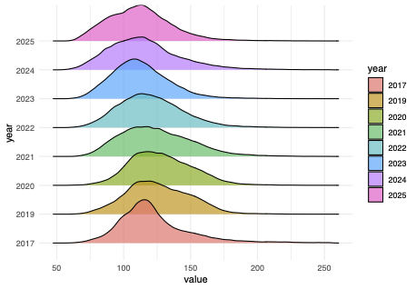

## Introduction

Ridgeline plots are partially overlapping line plots that create the impression of a mountain range. They can be quite useful for visualizing changes in distributions over time or space.

For this reason, I decided to use this representation for the study of images.
Specifically, the study utilizes satellite images obtained by Copernicus to analyze the continuity of vegetation.

The analysis was performed using the NDVI index, which indicates vegetation health.
Images were taken over several years of the same area, which was hit by a storm in 2018 that knocked down many trees.

Ridgeline plots are partially overlapping line plots that create the impression of a mountain range. They can be quite useful for visualizing changes in distributions over time or space.


```{r, eval=F}
install.packages("ggridges")
install.packages("ggplot2")
install.packages("gtable", type = "source")
library(ggridges)
library(ggplot2)
library(gtable)
```

The geom geom_density_ridges calculates density estimates from the provided data and then plots those, using the ridgeline visualization. The height aesthetic does not need to be specified in this case.

```{r, eval=F}
ridge1b <- ggplot(df_all_zona1b, aes(x = value, y = year, fill = year)) +
  geom_density_ridges(alpha = 0.7, scale = 1) +
  theme_minimal()
```




