# Introduction
The classic analysis of land cover is based on Boolean logic, in which a pixel categorically belongs to a class (e.g., 1 for “Forest”, 0 for “Non-Forest”). 
However, natural ecosystems, especially after severe disturbances such as Storm Vaia in 2018 (HERE I MAY ADD), present ecological gradients and blurred transitions.

Using fuzzy logic in this model, each pixel is not a discrete class, but an ‘empirical model of reality’ with a degree of membership (𝜇) continuous between 0 and 1.

- Value 1.0: represents the "Ideal forest" (full photosynthetic biomass); 
- Value 0.0: represents the total absence of forest characteristics (bare soil, rock, or urban surfaces);  
- Intermediate Values (0.2 - 0.7): Describe the typical heterogeneity of post-disturbance environments, characterised by fallen tree trunks, pioneer herbaceous vegetation and shrubs.

The main objective of this analysis is to monitor the trajectory of forest recovery over time. 
In this context, the identification of specific types of non-forest land cover, such as the distinction between bare soil or fallen dry logs, is secondary to the main objective. 
Instead, the focus is entirely on quantifying how close each pixel is to returning to a functional forest state. 
By using a continuous scale from 0 (non-forest) to 1 (full forest), we ensure that the resulting temporal visualisations, such as Ridgeline Plots, remain immediately intuitive: a shift to the right of the curve clearly signals forest regrowth. 
Conversely, attempting to plot three or four distinct classes simultaneously would complicate interpretation.

# 1. Ridgeline plots

Ridgeline graphs are partially overlapping line graphs that create the impression of a mountain range. They can be very useful for visualising changes in distributions over time or space.

For this reason, I decided to use this representation for the study of images. Specifically, the study uses satellite images obtained from Copernicus to analyse vegetation continuity.

The analysis was performed using the NDVI index, which indicates the health of vegetation. The images were taken over several years in the same area, which was hit by a storm in 2018 that knocked down many trees. In the specific case below, I will discuss the Val di Fiemme.

```{r, eval=F}
install.packages("ggridges")
install.packages("ggplot2")
install.packages("gtable", type = "source")
library(ggridges)
library(ggplot2)
library(gtable)
```

<p align="center">
  
  <b>2017</b>
   
  <b>2019</b>
</p>

Here we can see two images of the same area in Trentino, specifically an area of Val di Fiemme. The first image dates back to 2017, while the second is from 2019.
The storm took place in October 2018, and here you can see the damage it caused in this area.

Another possible visualisation of the disaster can be obtained by observing false-colour RGB(NIR-Red-Green) images. This technique integrates the Near-Infrared (NIR) band, making it easier to identify stress in vegetation compared to true-colour visualisation, due to the specific spectral response of healthy plants.

<p align="center">
  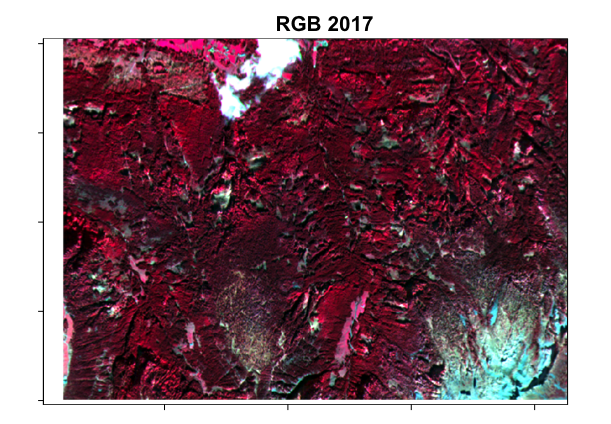
  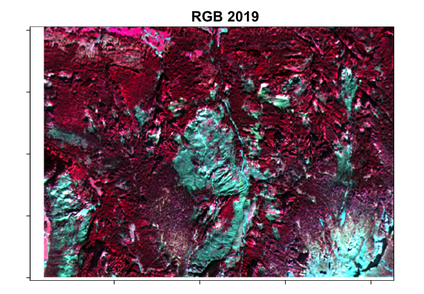 
  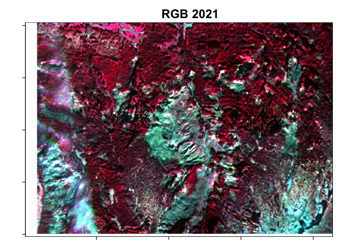 
  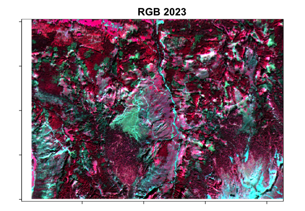 
  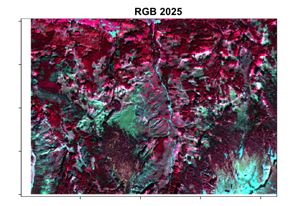 
</p>

Ridgeline plots were used on two occasions:
- for fuzzy membership;
- for calculating the NDVI.

# 2. Methodology and R implementation

## Phase 1: Spatial standardisation

A fixed region of interest measuring approximately 500 m x 500 m has been defined to create greater uniformity. This ensures that the temporal comparison between 2017, 2019, 2021, 2023 and 2025 takes place on the same spatial grid.

## Phase 2: Scientific calculation of NDVI
Instead of using pre-processed RGB images, the normalised vegetation index (NDVI) was calculated using raw Sentinel-2 L2A bands: B04 (red) and B08 (NIR). This avoids the colour distortion or saturation common in 8-bit compressed files.

```{r, eval=F}
ndvi17f <- (crop(b8_17, area_fissa) - crop(b4_17, area_fissa)) / (crop(b8_17, area_fissa) + crop(b4_17, area_fissa))
```
## Phase 3: Fuzzy transformation
In this step, the analysis moves from purely physical measurements (NDVI) to an ecological interpretation of the data. The main goal is to make visible the inherent uncertainty of a landscape undergoing recovery.

While a standard map might label a pixel as “Forest” or “Non-forest” using a hard cut-off, we use a linear transformation, implemented via the clamp function, to create a continuous gradient. This process essentially teaches the model how to interpret “green” based on the actual characteristics of the site:

Setting thresholds: we set 0.3 as the lower limit for “Non-forest” and 0.8 as the upper limit for “Pure forest”.

The lower limit: any pixel with an NDVI below 0.3 is assigned a membership value of 0. At this stage, we are not interested in the specific type of non-forest cover; we only recognise that it does not have forest characteristics.

The upper limit: pixels with an NDVI greater than 0.8 (dense, healthy canopy) are assigned a membership value of 1, representing “100% forest”.

The gradient: for all intermediate values (from 0.3 to 0.8), the values are mapped on a linear scale. For example, an NDVI of 0.55 translates to a membership of approximately 0.5.

In this way, we transform a raw spectral index into a meaningful probability of forest membership, allowing us to capture the “grey areas” that occur during natural recovery.
```{r, eval=F}
mem17f <- clamp((ndvi17f - 0.3) / (0.8 - 0.3), 0, 1)
```
## Phase 4: Statistical visualisation (Ridgeline plots) 
Temporal changes were visualised using Ridgeline plots

```{r, eval=F}
ggplot(df_totale, aes(x = membership, y = stato, fill = stato)) +
  geom_density_ridges(alpha = 0.7, quantile_lines = TRUE, quantiles = 2, scale = 1.2) +
  theme_minimal() +
  labs(title = "Forest Recovery Trajectory",
       subtitle = "Evolution of fuzzy membership",
       x = "Fuzzy Membership",
       y = NULL) +
  xlim(0, 1)
```
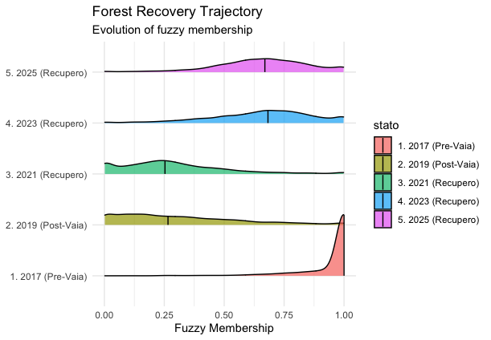

```{r, eval=F}
ggplot(df_ndvi_totale, aes(x = ndvi_value, y = stato, fill = stato)) +
  geom_density_ridges(alpha = 0.7, quantile_lines = TRUE, quantiles = 2, scale = 1.2) +
  theme_minimal() +
  labs(title = "Distribution of NDVI Values",
       subtitle = "Direct comparison of photosynthetic biomass without fuzzy filters",
       x = "NDVI value (-1 to 1)",
       y = NULL) +
  xlim(-0.2, 1)
```
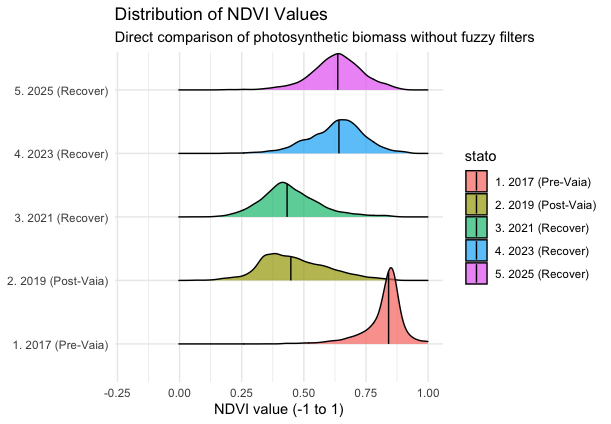

# 3. Interpretation of Results

- 2017 (Pre-Vaia): A narrow, unimodal distribution peaking at 𝜇≈1, indicating high stability and forest homogeneity.
- 2019 (Post-Vaia): a flattened, broad distribution. This reflects the collapse of the forest structure and the resulting heterogeneous landscape.
- 2021-2025 (Recovery): The distribution gradually re-stabilises into a unimodal shape centred around 𝜇≈0.4 - 0.5. This indicates the establishment of a stable pioneer cover (shrubs/grasses), which has successfully stabilised the site even though the original arboreal biomass has not yet been restored.

#  Area  of study: "Piana di Marcesina"
The Marcesina Plain is a vast plateau located in the north-eastern part of the "Altopiano dei Sette Comuni", between the province of Vicenza and the autonomous province of Trento.
The landscape here suffered devastating damage, with thousands of hectares of forest felled (approximately 800,000 cubic metres of timber in the area alone) and a radically transformed area.

<p align="center">
  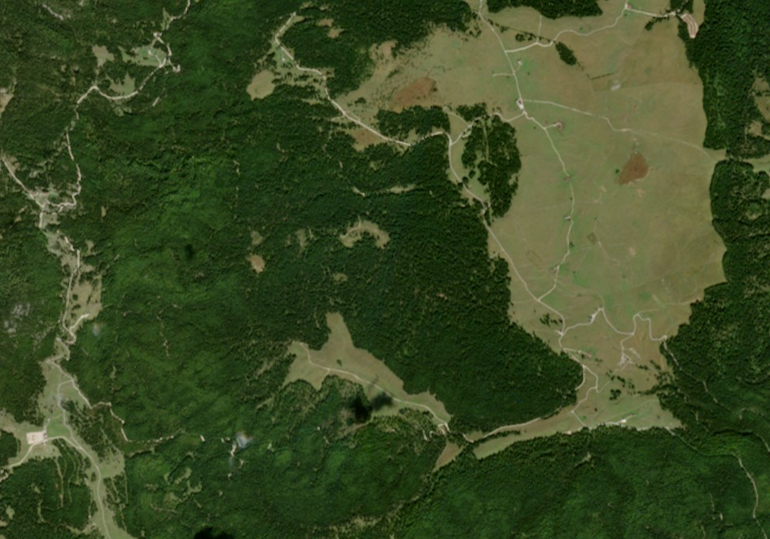
  <b>2017</b>
  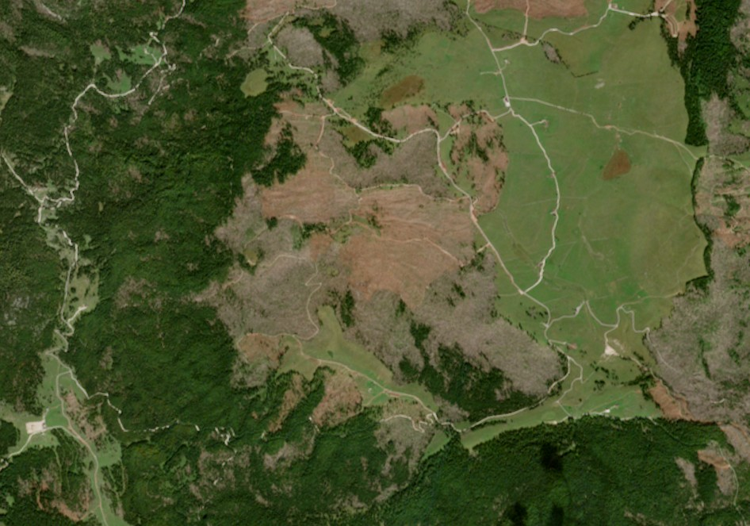 
  <b>2019</b>
  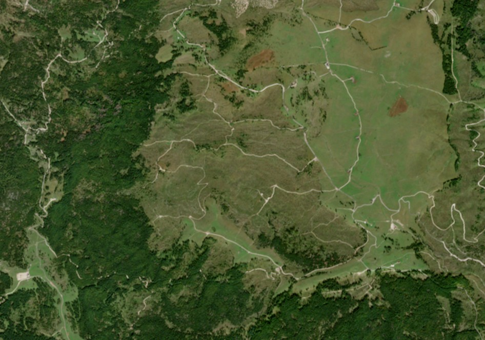 
  <b>2025</b>
</p>

Here too, we can use false-colour RGB(NIR-Red-Green) images visualisation.

<p align="center">
  
   
   
   
   
</p

# Methodology and R implementation

The operational study scheme for the area that I used here is the same as that used previously in the Val di Fiemme case study. 
So I identified a study area (500m x 500m), then I calculated the NDVI for the area, and finally I performed the fuzzy transformation and created the ridgeline plots to visualise the fuzzy membership and distribution of the NDVI index.

Here you can find the results.

<p align="center">
  
  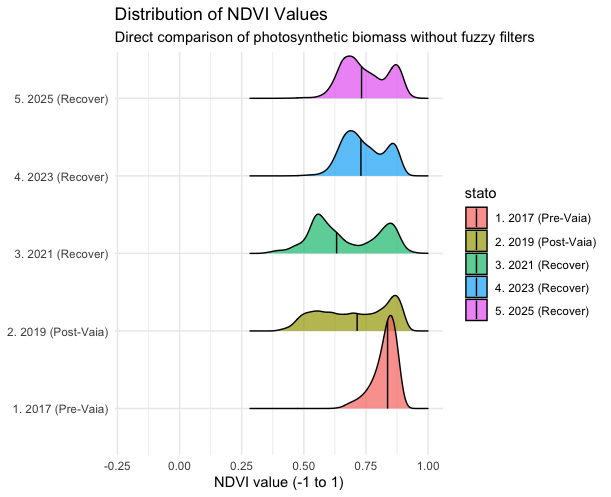 
</p>


